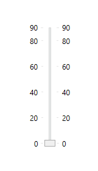
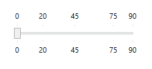
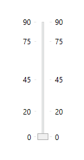
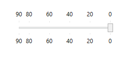
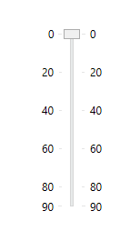
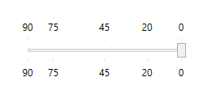
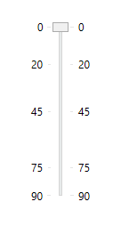
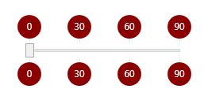
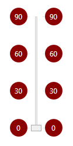

# SliderWithTickLabels WPF Control

This is a extension to the Slider [Slider WPF Control](https://docs.microsoft.com/dotnet/api/system.windows.controls.slider). I created this extension with the purpose of allowing the slider to have labels on tick marks.

The most visible additions I've made to original Slider are two properties, `TickLabelTemplate`, where you can optionally make your own label template (you can even create complex objects, such as panels with more than one child element inside), and `GeneratedTicks`, that holds the tick values (without knowing previously the ticks, it's very difficult to generate the labels). Other properties and the rest of the control remains the same as the original control.

And last, but not least: labels follow TickPlacement property, just like the ticks themselves.

## Usage

Just reference [SliderWithTickLabels.dll](ComponentTest/bin/Debug/SliderWithTickLabels.dll) file and it will be immediatly available to your XAML editor.

## Examples

Below are simple examples of how you can use SliderWithTickLabels control. I tried to keep them as simple as possible. Of course, you can make more elaborate constructions to fit your needs.

### Basic

The only necessary property to show the labels is TickPlacement. The rest of properties were modified to create a more interesting example.

#### Horizontal

##### Code:
```xml
<custom:SliderWithTickLabels
	Orientation="Horizontal"
	Width="200"
	TickPlacement="Both"
	Minimum="0"
	Maximum="90"
	TickFrequency="20"/>
```

##### Result:


#### Vertical

##### Code:
```xml
<custom:SliderWithTickLabels
	Orientation="Vertical"
	Height="200"
	TickPlacement="Both"
	Minimum="0"
	Maximum="90"
	TickFrequency="20"/>
```

##### Result:



### Custom ticks

Just like the original Slider control, you will always have ticks at minimum and maximum positions, regardless they were declared or not in `Ticks` property.

#### Horizontal

##### Code:
```xml
<custom:SliderWithTickLabels
	Orientation="Horizontal"
	Width="200"
	TickPlacement="Both"
	Minimum="0"
	Maximum="90"
	Ticks="20, 45, 75"/>
```

##### Result:


#### Vertical

##### Code:
```xml
<custom:SliderWithTickLabels
	Orientation="Vertical"
	Height="200"
	TickPlacement="Both"
	Minimum="0"
	Maximum="90"
	Ticks="20, 45, 75"/>
```

##### Result:


### Reverse direction

Set `IsDirectionReversed` property to `True` and labels will follow the setting.

#### Horizontal

##### Code:
```xml
<custom:SliderWithTickLabels
	Orientation="Horizontal"
	Width="200"
	TickPlacement="Both"
	Minimum="0"
	Maximum="90"
	TickFrequency="20"
	IsDirectionReversed="True"/>
```

##### Result:


#### Vertical

##### Code:
```xml
<custom:SliderWithTickLabels
	Orientation="Vertical"
	Height="200"
	TickPlacement="Both"
	Minimum="0"
	Maximum="90"
	TickFrequency="20"
	IsDirectionReversed="True"/>
```

##### Result:



### Reverse direction and custom ticks

You can combine different settings, and it will work just like as expected.

#### Horizontal

##### Code:
```xml
<custom:SliderWithTickLabels
	Orientation="Horizontal"
	Width="200"
	TickPlacement="Both"
	Minimum="0"
	Maximum="90"
	Ticks="20, 45, 75"
	IsDirectionReversed="True"/>
```

##### Result:


#### Vertical

##### Code:
```xml
<custom:SliderWithTickLabels
	Orientation="Vertical"
	Height="200"
	TickPlacement="Both"
	Minimum="0"
	Maximum="90"
	Ticks="20, 45, 75"
	IsDirectionReversed="True"/>
```

##### Result:



### Custom label template

You can modify the label template to whatever you want setting the `TickLabelTemplate` property with a DataTemplate.

#### Horizontal

##### Code:
```xml
<custom:SliderWithTickLabels
	Orientation="Horizontal"
	Width="200"
	TickPlacement="Both"
	Minimum="0"
	Maximum="90"
	TickFrequency="30">
	<custom:SliderWithTickLabels.TickLabelTemplate>
		<DataTemplate>
			<Grid Width="30" Height="30">
				<Grid.Background>
					<VisualBrush>
						<VisualBrush.Visual>
							<Ellipse Width="30" Height="30" Fill="DarkRed"/>
						</VisualBrush.Visual>
					</VisualBrush>
				</Grid.Background>
				<Label
					HorizontalAlignment="Center"
					VerticalAlignment="Center"
					Content="{Binding}"
					Padding="0"
					Foreground="White"/>
			</Grid>
		</DataTemplate>
	</custom:SliderWithTickLabels.TickLabelTemplate>
</custom:SliderWithTickLabels>
```

##### Result:


#### Vertical

##### Code:
```xml
<custom:SliderWithTickLabels Orientation="Vertical" Height="200" TickPlacement="Both" Minimum="0" Maximum="90" TickFrequency="30">
	<custom:SliderWithTickLabels.TickLabelTemplate>
		<DataTemplate>
			<Grid Width="30" Height="30">
				<Grid.Background>
					<VisualBrush>
						<VisualBrush.Visual>
							<Ellipse Width="30" Height="30" Fill="DarkRed"/>
						</VisualBrush.Visual>
					</VisualBrush>
				</Grid.Background>
				<Label
					HorizontalAlignment="Center"
					VerticalAlignment="Center"
					Content="{Binding}"
					Padding="0"
					Foreground="White"/>
			</Grid>
		</DataTemplate>
	</custom:SliderWithTickLabels.TickLabelTemplate>
</custom:SliderWithTickLabels>
```

##### Result:
